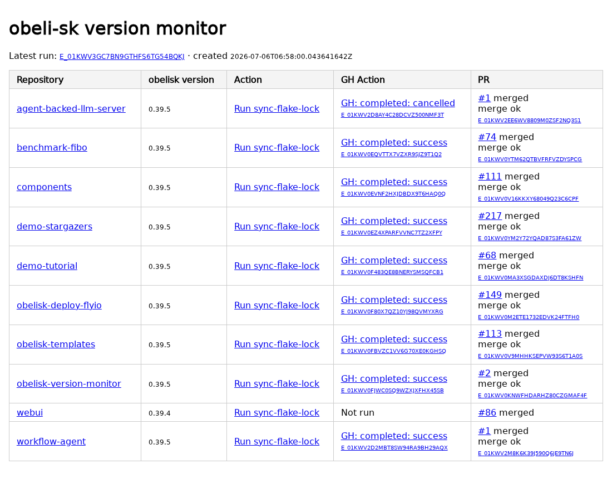

# Obelisk Version Monitor

An [Obelisk](https://obeli.sk/) application that monitors the Obelisk version
pinned by public repositories in the
[`obeli-sk`](https://github.com/obeli-sk) organization.

The dashboard can:

- show the version from each repository's `dev-deps.txt`;
- dispatch its `sync-flake-lock.yml` GitHub Actions workflow;
- track the Obelisk activity and GitHub Actions run;
- find the resulting ``Sync `flake.lock` from upstream`` pull request;
- display pull request checks; and
- merge a passing pull request through an audited Obelisk activity.

## Dashboard

The dashboard is served by the `show` webhook endpoint. It polls JSON status
without reloading the page.



Each Obelisk activity displays its execution ID. GitHub Actions runs and pull
requests link to GitHub.

## Development

Enter the development shell:

```sh
nix develop
```

Set a GitHub token with permission to dispatch workflows and merge pull
requests:

```sh
export GH_TOKEN="$(gh auth token)"
```

Verify the deployment:

```sh
obelisk server verify \
  --deployment deployment.toml \
  --allow-unavailable-runtime-config \
  --skip-db
```

Run it
```sh
obelisk server run --server-config server.toml --deployment deployment.toml
```

With the default server configuration, the dashboard is available at
<http://127.0.0.1:9090/>.
