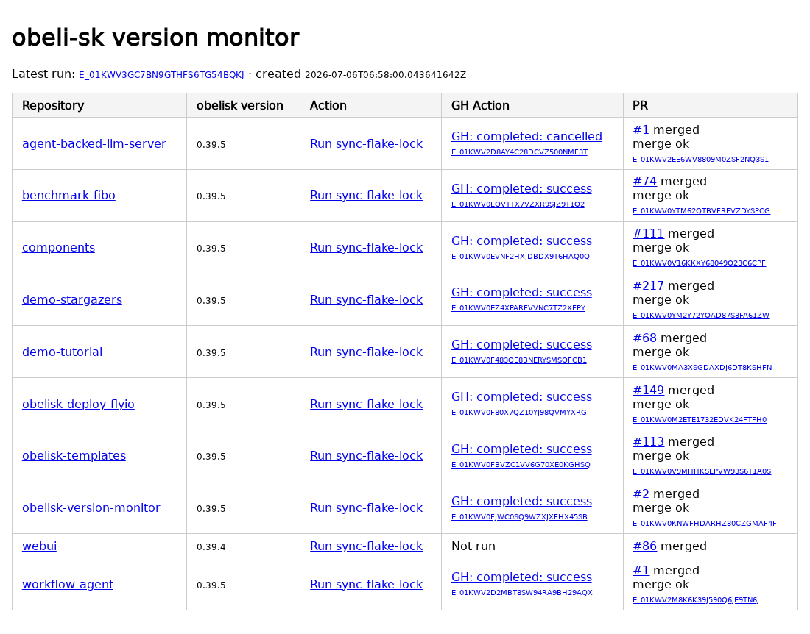

# Obelisk Version Monitor

An [Obelisk](https://obeli.sk/) application that monitors the Obelisk version
pinned by public repositories in the
[`obeli-sk`](https://github.com/obeli-sk) organization.

The dashboard can:

- show the version from each repository's `dev-deps.txt`;
- batch-dispatch `sync-flake-lock.yml` over selected repositories (checkboxes plus one button);
- link the latest `sync-flake-lock.yml` GitHub Actions run per repository;
- list every open ``Sync `flake.lock` from upstream`` pull request with its checks; and
- merge a passing pull request through an audited Obelisk activity.

Every column is produced by the monitor workflow itself, so page loads read a
single execution result rather than crawling GitHub or execution history.

## Dashboard

The dashboard is served by the `show` webhook endpoint. It polls JSON status
without reloading the page.



Each row links to the shared monitor execution that produced it. Obelisk
activities display their execution IDs, while GitHub Actions runs and pull
requests link to GitHub.

## Development

Enter the development shell:

```sh
nix develop
```

Set a GitHub token with permission to dispatch workflows and merge pull
requests:

```sh
export GH_TOKEN="$(gh auth token)"
```

Verify the deployment:

```sh
obelisk deployment verify \
  --server-config server.toml \
  --deployment deployment.toml \
  --allow-unavailable-runtime-config
```

Run it
```sh
export OBELISK__API__TOKEN=$(obelisk generate token)
obelisk server run --server-config server.toml --deployment deployment.toml
```

With the default server configuration, the dashboard is available at
<http://127.0.0.1:9090/>.
